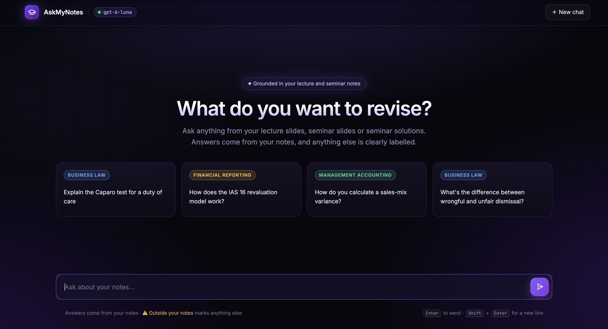

# AskMyNotes

An AI study assistant that answers questions from my own university lecture and seminar notes, and tells me plainly when an answer comes from somewhere else.

It is built as an agent: the model decides for itself when a question needs my notes, searches them, and writes an answer grounded in what it found. General questions get a normal answer without a search. A separate evaluation suite measures how accurate and how well grounded the answers are.



> **This is a personal learning project.** It runs on my own notes, which are not included in this repository. The answers are a revision aid, not a substitute for the course material.

---


## Why I built it

General chatbots are good at explaining a topic, but they explain *their* version of it. For revision I need the version my lecturers taught: their definitions, their worked examples, the cases on their slides. An answer that is correct in general but different from my notes can cost marks.

So I wanted an assistant with two properties. It should answer from my notes first, using their wording and figures. And it should never blur the line between "this is in your notes" and "this is general knowledge", because that line is exactly what I need to see when revising.

It was also how I learned retrieval-augmented generation (RAG), agents and evaluation properly: by building each part, measuring it, and fixing what the measurements showed.

---


## What it does

- **Answers from the notes.** Questions about a legal test, an accounting standard or a calculation are answered from the lecture slides, seminar slides and seminar solutions, with the source named at the end.
- **Labels anything from outside them.** Extra context that is not in the notes goes under a clearly marked heading, shown in the app as an amber box. If the notes do not cover a topic, it says so first.
- **Works as a general assistant too.** A question that has nothing to do with my modules gets a normal answer, without a search and without the labels.
- **Handles follow-ups.** "And what about the third stage?" is turned into a proper search for the topic being discussed.
- **Will not guess admin details.** Exam dates, rooms and deadlines are never stated as fact. It points me to the timetable or Moodle instead.
- **Teaches, not just answers.** Replies come from a sarcastic tutor persona and end with a one-line "Remember:" summary, sometimes with a quick question to test recall.


---


## How it works

```
My lecture files (PowerPoint, Word, PDF)
        │  converted to Markdown                      convert_to_markdown.py
        ▼
Split into chunks, each labelled with its
module, type (lecture / seminar) and file            rag/ingest.py
        │  embedded with text-embedding-3-large
        ▼
Vector database (Chroma)

At question time:
Question ──► Agent ──► needs my notes? ── no ──► answers directly
                            │ yes
                            ▼
                 search_notes(query written by the agent)
                            │  top 20 chunks by similarity
                            │  reranked by a model, best 10 kept
                            ▼
                 Agent writes the answer from those chunks,
                 labels anything from outside them, cites the source
```

**Preparing the notes.** `convert_to_markdown.py` turns lecture files into Markdown. `rag/ingest.py` splits them into chunks of about 1,250 characters and adds a header to each one giving its module, its type and its file name. That header matters later: it is how the assistant tells a lecture slide from a seminar exercise.

**Searching.** `rag/retrieval.py` finds the 20 chunks closest in meaning to the query, then asks a model to rerank them and keeps the best 10. The first step is fast but rough; the rerank puts the chunks that actually answer the question at the top.

**The agent.** `rag/agent.py` defines an agent with the OpenAI Agents SDK and gives it one tool, `search_notes`. The agent reads each message and chooses whether to call the tool. When it does, it writes its own search query, and it can search again if a question covers two topics or the first results are thin.

**The instructions.** `instruction.py` holds the rules the agent follows once it has searched: use the notes' own terms and figures, say what the notes do not cover, keep outside knowledge under its heading, show the working in calculations, and name the source. `answer_examples.py` adds five worked examples of the behaviour, and `personality.py` sets the tutor's voice.

**The app.** `app.py` is a Gradio chat interface. Answers stream in as they are written, a stop button cancels a reply part-way, and the outside-knowledge section is drawn as a highlighted box.

**Models.** GPT-6 Luna answers the questions, reranks the search results and acts as the judge in the evaluation. OpenAI's `text-embedding-3-large` creates the embeddings.

---


## Key design decisions

**The model decides when to search.**
The first version searched the notes for every message, which suited revision questions and nothing else. Making the search a tool the agent chooses to use lets the same app answer a general question sensibly, and lets the agent rewrite a vague follow-up into a precise query before searching.

**Notes and outside knowledge are kept visibly apart.**
Everything not found in the notes goes under one fixed heading, after the notes-based answer. I chose a fixed heading over a softer instruction like "mention when you add detail" because it can be checked: the evaluation scores it, and the app styles it.

**Every chunk says where it came from.**
Seminar exercises use invented parties and scenarios. Without a label, the assistant treated a made-up seminar scenario as a real case. Each chunk now starts with its module, its type and its file, and the instructions tell the agent to take cases and definitions from lecture slides.

**Admin details are never trusted.**
A wrong exam date is worse than no exam date. Even when a slide mentions one, the assistant is told not to state it as fact.

**Maths is written in plain text.**
Formulas use ordinary symbols (×, ÷, √) instead of LaTeX. Rendering LaTeX while an answer streams made the text flicker, and plain text reads cleanly throughout.

**Accuracy and grounding are scored separately.**
"Is this correct?" and "did this come from the notes?" are different questions. Scoring them together hid what was going wrong, as the testing below shows.

---


## Evaluation

The evaluation answers two questions separately: does the search find the right material, and is the final answer good?

**The test set.** The full set has around 135 questions across three modules, with a smaller set of 44 for quick, cheap runs. Each test has a question, a reference answer, keywords that should appear in the retrieved notes, and a category:


| Category    | What it tests                                            |
| ----------- | -------------------------------------------------------- |
| Direct fact | A fact stated on one slide                               |
| Definition  | A term the notes define                                  |
| Calculation | A worked numerical example                               |
| Spanning    | An answer that needs material from more than one lecture |
| Paraphrased | A question worded differently from the notes             |
| Not covered | A topic the notes do not contain                         |


**Retrieval evaluation.** Each question is run through the search and scored on MRR (how near the top the first relevant chunk appears), nDCG (how well all the relevant chunks are ranked) and keyword coverage (how many of the expected keywords were found).

**Answer evaluation.** Each question is run through the agent, and a judge model scores the answer from 1 to 5 on four dimensions, against a written rubric:


| Dimension    | Question it answers                                              |
| ------------ | ---------------------------------------------------------------- |
| Accuracy     | Are the claims correct, judged against the reference and notes?  |
| Completeness | Does it cover the key points in the reference answer?            |
| Relevance    | Does it answer the question asked, without padding?              |
| Grounding    | Does it stick to the notes and label anything from outside them? |


The judge is given the notes the agent retrieved, so grounding is checked against what the assistant actually saw, not guessed.

**The dashboard.** `evaluation/evaluator.py` shows the scores, a grid of results by module and question type, and every test with the judge's feedback, weakest first.


### Results

Small test set, 44 answers, measured on my second-year notes (Business Law, Financial Reporting and Intermediate Management Accounting):


| Dimension    | Fixed pipeline | Agent    |
| ------------ | -------------- | -------- |
| Accuracy     | 4.89           | **4.98** |
| Completeness | 4.27           | **4.32** |
| Relevance    | **4.98**       | 4.52     |
| Grounding    | **4.82**       | 4.73     |


Moving from a fixed pipeline to an agent kept accuracy and completeness at the same level or slightly higher. Relevance fell. The tutor persona was added between the two runs, and its opening line, "Remember:" summary and quick question are the kind of extra text the relevance rubric marks down, so I believe the persona explains most of the drop. I have not yet run the two changes separately to confirm it.

The knowledge base has since moved to my final-year modules. The test set still covers the second-year notes, so these figures describe the system on that material, and a new test set is needed for the current one.

---


## What testing showed

**The judge was measuring the wrong thing.** Early runs scored accuracy at 3.23 out of 5. Reading the judge's feedback showed why: the rubric told it to give the lowest mark whenever an answer included correct detail that was not in the reference. Correct answers were failing for being thorough. I rewrote the rubric with fixed descriptions for each score and moved "did this come from the notes?" into its own grounding score. Accuracy on the same tests rose to 4.89. A change to the chunk headers went into the same run, so I cannot say exactly how much each contributed, but the feedback made clear the rubric was the main cause.

**A made-up case was presented as real law.** In Business Law, the assistant answered a question about a real case by citing "E v F", the invented parties in a seminar exercise. Direct-fact questions for that module scored 1.00 out of 5. Labelling each chunk as lecture or seminar material, and telling both the agent and the reranker to prefer lecture slides for cases and definitions, took that score to 5.00.

**Asking a model to do the chunking made retrieval much worse.** I tried having a small model split the documents into chunks with headlines and summaries. Keyword coverage fell from 90% to 44%, because the model silently left text out. I went back to a plain text splitter. The lesson was to measure a clever idea before trusting it.

**One of my own prompt examples leaked a test answer.** A worked example in the instructions described the format of an exam, which was also a question in the test set. The assistant was being handed that answer on every run. I replaced the example and checked the others against the test set.

**Cost shaped the choice of judge.** One full answer evaluation with a larger model cost over $2. Switching to a cheaper model made it practical to evaluate after every change, which mattered more than a marginally better judge.

---


## Running it

You will need your own notes: the `knowledge_base/` and `vector_db/` folders are not in this repository.

```bash
git clone https://github.com/MatthewGilham/AskMyNotes.git
cd AskMyNotes
python3 -m venv .venv
source .venv/bin/activate
pip install -r requirements.txt
```

Create a `.env` file in the project folder:

```
OPENAI_API_KEY=your-key-here
```

**1. Convert your notes.** In `convert_to_markdown.py`, set `SOURCES` to your own folders. Each one maps to a destination of the form `year/module/type`, which is where the chunk labels come from.

```bash
python convert_to_markdown.py
```

**2. Build the vector database.** Run this again whenever you add notes.

```bash
python -m rag.ingest
```

**3. Start the app.**

```bash
python app.py
```

Module names appear in `rag/agent.py` (the search tool's description), `instruction.py` and the example cards in `app.py`. Change them to match your own subjects.

### Running the evaluation

```bash
python -m evaluation.evaluator     # dashboard: retrieval and answer scores
python -m evaluation.eval 12       # one test in detail (here, test number 12)
```

The included test sets and the examples in `answer_examples.py` were written for my notes. To evaluate your own, write tests in the same format in `evaluation/tests.jsonl`.

---


## Project structure


| File                           | Purpose                                                         |
| ------------------------------ | --------------------------------------------------------------- |
| `app.py`                       | Gradio chat interface, streaming and the stop button            |
| `theme.py`                     | Colours, layout and styling for the interface                   |
| `convert_to_markdown.py`       | Converts Word, PowerPoint and PDF files to Markdown             |
| `rag/ingest.py`                | Splits and labels the notes, embeds them, builds the database   |
| `rag/retrieval.py`             | Vector search and reranking                                     |
| `rag/agent.py`                 | The agent, its `search_notes` tool, and the streaming functions |
| `instruction.py`               | The agent's rules for searching, grounding and labelling        |
| `personality.py`               | The tutor persona                                               |
| `answer_examples.py`           | Five worked examples of the expected behaviour                  |
| `evaluation/tests.jsonl`       | The full test set                                               |
| `evaluation/tests_small.jsonl` | The small test set for quick runs                               |
| `evaluation/test.py`           | Loads and validates the tests                                   |
| `evaluation/eval.py`           | Retrieval metrics, answer evaluation and the judge              |
| `evaluation/evaluator.py`      | Evaluation dashboard                                            |


---


## Limitations

- **The judge and the assistant are the same model.** A model may mark its own style of answer generously. The accuracy figures should be read with that in mind.
- **Small groups are noisy.** Each module and category pair has two or three tests in the small set, so one answer can move a group's average by a full point.
- **Slides lose information in conversion.** Diagrams and images are dropped, and scanned PDFs with no text layer are skipped.
- **Each conversation starts from nothing.** Chats are not saved between sessions.
- **Built for one person.** There are no user accounts, and the module names are written into the prompts.

---


## Planned next

- **Web search as a second tool,** for current information such as tax rates, with results labelled and linked like any other outside knowledge.
- **Screenshot input,** to drop in a past-paper question and have it worked through from the notes.
- **Saved conversations,** stored locally in SQLite.
- **Local open-source models,** so documents more private than lecture notes never leave my computer.

---


## Built with

Python · OpenAI Agents SDK · Gradio · Chroma · LiteLLM · LangChain text splitters · MarkItDown · Pydantic · pandas